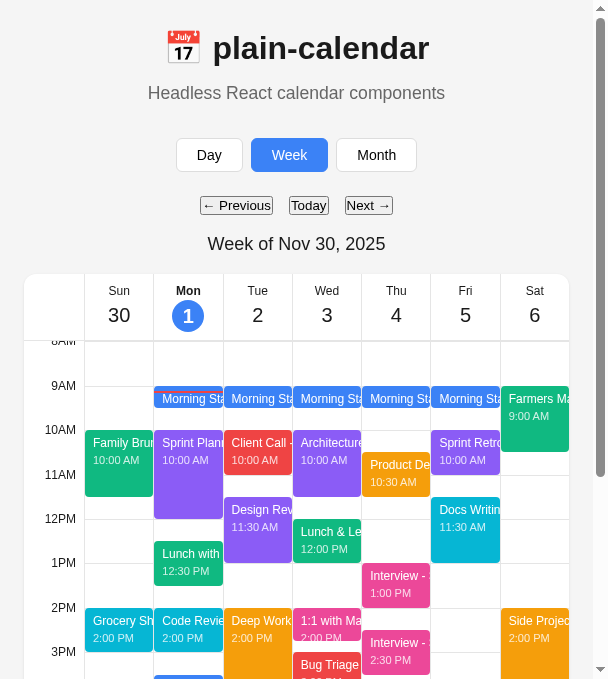

# Plain Calendar

**Headless React calendar component library**

Build custom calendar interfaces with unstyled, accessible primitives.



**[Live Demo →](https://plain-cal-demo.pages.dev)**

## Philosophy

Like TanStack Table for calendars - we provide the logic, you provide the UI.

## Features

- **Headless architecture** - Full control over styling and markup
- **Composable primitives** - Use only what you need
- **Type-safe** - Built with TypeScript
- **Accessible** - ARIA-compliant components
- **Zero dependencies** - Only React as peer dependency

## Packages

| Package | Description |
|---------|-------------|
| `@plain-calendar/core` | Pure TypeScript utilities and types |
| `@plain-calendar/react` | React hooks and components |

## Installation

```bash
npm install @plain-calendar/react
```

## Quick Start

```tsx
import { 
  useCalendarState, 
  WeekView, 
  Timeline, 
  Calendar 
} from '@plain-calendar/react'

function MyCalendar() {
  const calendar = useCalendarState({ view: 'week' })
  const events = [...] // Your events

  return (
    <WeekView
      events={events}
      weekStart={calendar.viewStartDate}
      startHour={8}
      endHour={20}
      renderEvent={(event) => (
        <div className="my-event-style">
          {event.event.title}
        </div>
      )}
    />
  )
}
```

## Hooks

| Hook | Description |
|------|-------------|
| `useCalendarState` | Calendar navigation and date state |
| `useTimeRange` | Calculate visible time range |
| `useEventLayout` | Position events with overlap handling |
| `useEventsMap` | Group events by date |
| `useTimeAxis` | Generate time axis labels |
| `useGridLines` | Generate grid lines |
| `useCurrentTimeIndicator` | Track "now" line position |

## Components

| Component | Description |
|-----------|-------------|
| `Timeline` | Day view with time-based layout |
| `WeekView` | 7-day week grid |
| `Calendar` | Month grid view |
| `EventBlock` | Positioned event display |

All components are **headless** - they provide structure and logic, you provide the styling via render props.

## Development

```bash
# Clone and install
git clone https://github.com/alosec/plain-calendar.git
cd plain-calendar
pnpm install

# Run tests
pnpm test

# Build
pnpm build
```

## Status

**Active Development** - Core functionality complete, working on polish and publishing.

- ✅ Core utilities and types
- ✅ React hooks (9 hooks)
- ✅ React components (4 components)
- ✅ Demo site deployed
- 🔲 npm publishing
- 🔲 E2E tests
- 🔲 CI/CD pipeline

## License

MIT

---

Built by [alosec](https://github.com/alosec) • Extracted from [PediCalendar](https://pedicab512.com) production codebase
